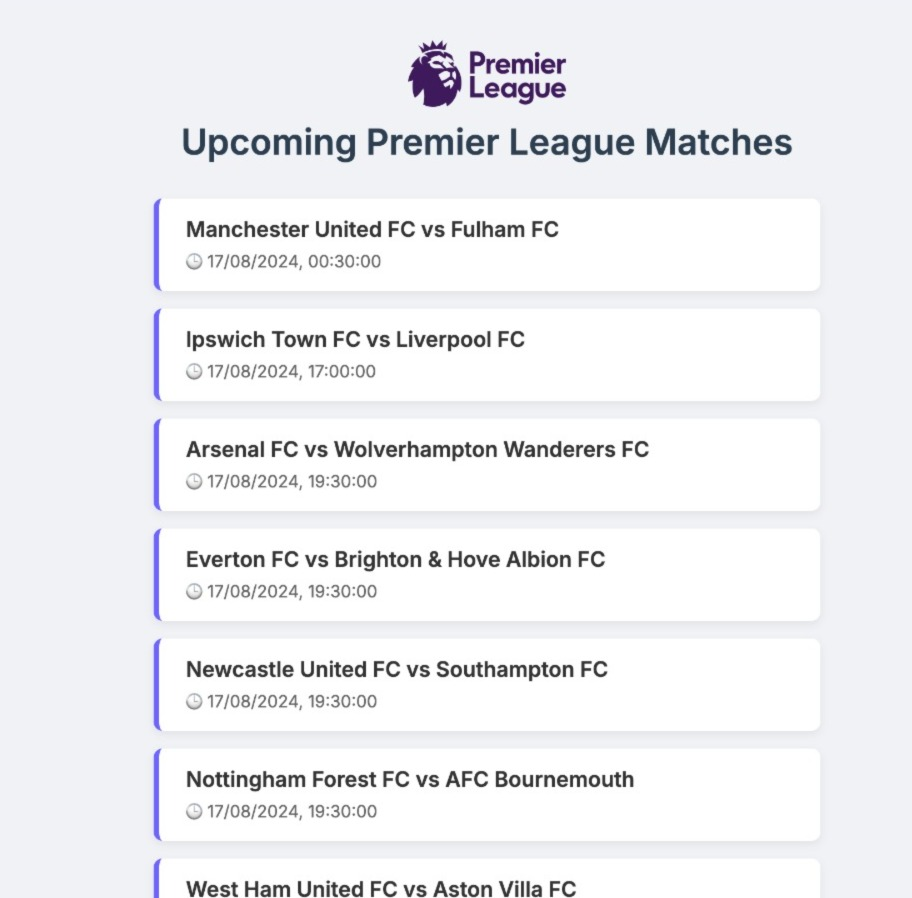
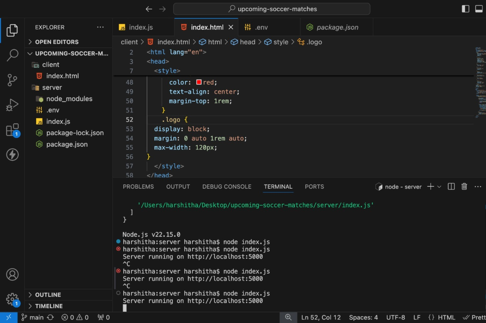

# 🏆 Upcoming Premier League Matches

A basic web application that displays upcoming Premier League matches using the [football-data.org](https://www.football-data.org/) API.

## 🔗 API Used

- API: [https://api.football-data.org/v4/matches](https://api.football-data.org/v4/matches)
- Requires a free API key (no card needed)

## 📸 Screenshots

### ✅ Match List UI


### ✅ Backend Running


## 🚀 Features

- Displays match date/time and both teams
- Uses Premier League 2021 season data
- Styled cleanly with logo

## 🛠️ Tech Stack

- HTML
- Node.js + Express (Backend)

## ▶️ Run Locally

1. Clone the repo
2. Install backend dependencies:

```bash
cd server
npm install
node index.js
